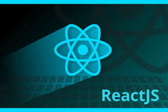

# ReactJS-Applications
Applications madeup with ReactJS  👨‍💻👩‍💻

React.js is an open-source JavaScript library that is used for building user interfaces specifically for single-page applications. 
It's used for handling the view layer for web and mobile apps. React also allows us to create reusable UI components.

## Installation for windows OS

To install the react application follow these steps
- Install nodeJS by using this link [node.org](https://nodejs.org/en/)
- Create your project folder and open the terminal or command prompt for windows
- Type `npx create-react-app` 
- Then `npm create-react-app  project name`
- Then type `cd projectname`
- Then `npm start`
-  It will install all modules and start run on your browser in local host
- Then start code your react project 
- run your work by using  `npx run` 

Thats all about installation and running your react application on local host👨‍💻

